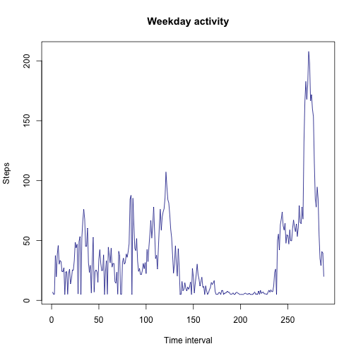
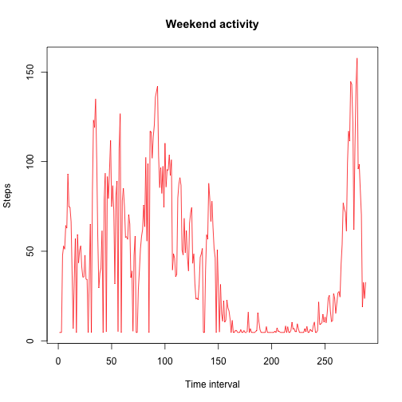

# Activity Monitoring Data
### by Michael Kothakota
========================================================
## Read in the data file and preprocess 


```r
ad <- read.csv("activity.csv")
```

Variables are easier to manipulate if they are transformed into a slightly more user friendly format.


```r
steps <- ad$steps
date <- ad$date
interval <- ad$interval
```

You may want to get a visual idea of the distribution of steps taken in a day, so building a histogram will be helpful in examining these data.

## Building a Histogram


```r
hist(tapply(steps, date, sum), xlab="Steps", ylab= "Days", breaks=10, main="Steps taken on a Daily basis")
```

 

## Calculate the Mean and Median Values

Examination of the mean and median can be helpful in getting a good handle on the measures of central tendency in the data.

We first create a framework that allows us to calculate the mean or median per day:


```r
steps_day <- as.numeric(tapply(steps, date, sum))
```

Then calculate the mean:


```r
mean_steps_day <- mean(steps_day, na.rm=TRUE)
```

The mean of the total number of steps taken per day is 1.0766 &times; 10<sup>4</sup>.

Then calculate the median:


```r
median_steps_day <- median(steps_day, na.rm=TRUE)
```

The median of the total number of steps taken per day is 1.0765 &times; 10<sup>4</sup>

Thus, the median and the mean values are very close together.

## Compute the average daily activity pattern

We want to build a time series plot at five minute intervals in order to obesrve the activity pattern.  

You'll first want to change the interval variable to a factor variable and calculate the mean - as we have done above.


```r
interval <- as.factor(as.character(interval))
mean_int <- as.numeric(tapply(steps, interval, mean, na.rm=TRUE))
```

A good way to view the data is to build a data frame consisting of the intervals tied to the mean calculated above.


```r
trueint <- data.frame(trueint = as.numeric(levels(interval)),mean_int)
```

We want to order the intervals.


```r
trueint <- trueint[order(trueint$trueint),]
```

### Build the plot


```r
plot(trueint$trueint, trueint$mean_int, type = "l", main = "Average steps per minute", xlab="Time of Day", ylab="Mean Steps")
```

 

Each 500 interval on the x-axis equals 5 minutes during the day.

### 5-minute Interval with the most average steps

You will need to sort the data so that the the time interval is associated with it's corresponding average time interval


```r
aveintper <- trueint[order(trueint$mean_int, decreasing=TRUE),]
```

We only want the top value, so as not to populate with unneeded information


```r
head(aveintper, n=1)
```

```
##     trueint mean_int
## 272     835    206.2
```

Thus, the highest number of average steps in a given interval is 206.2, which occurs at the beginning of the 8:35 interval and ends at the 8:40.

## Input Missing Values

The first step is to find the numberof missing values in the dataset:


```r
missvals <- sum(is.na(steps))
```

Note: you could also use the 'summary' function on the entire dataset and you would get an output with all of the missing NA values.

The number of missing values for the steps variable is 2304

You will need to replace these 2304 missing values with another value.  For this analysis, we used the mean value of steps, whihc is 37.38.

### Replacing the NA values


```r
steps[is.na(steps)] <- 37.38
```

Check to see if the NA values still exist.


```r
summary(steps)
```

```
##    Min. 1st Qu.  Median    Mean 3rd Qu.    Max. 
##     0.0     0.0     0.0    37.4    37.4   806.0
```

They don't, so now we would create a new dataframe:


```r
newad <- data.frame(steps=steps, date=date, interval = interval)
```

View a summary of the new data frame.


```r
summary(newad)
```

```
##      steps               date          interval    
##  Min.   :  0.0   2012-10-01:  288   0      :   61  
##  1st Qu.:  0.0   2012-10-02:  288   10     :   61  
##  Median :  0.0   2012-10-03:  288   100    :   61  
##  Mean   : 37.4   2012-10-04:  288   1000   :   61  
##  3rd Qu.: 37.4   2012-10-05:  288   1005   :   61  
##  Max.   :806.0   2012-10-06:  288   1010   :   61  
##                  (Other)   :15840   (Other):17202
```

We should check a histogram with these new data, along with calculating a new mean and median value.


```r
hist(tapply(newad$steps, newad$date, sum), xlab="Steps", ylab= "Days", breaks=10, main="Steps taken on a Daily basis")
```

 


```r
newsteps_day <- as.numeric(tapply(newad$steps, newad$date, sum))
```

Then calculate the mean:


```r
newmean_steps_day <- mean(newsteps_day, na.rm=TRUE)
```

The mean of the total number of steps taken per day is 1.0766 &times; 10<sup>4</sup>.

Then calculate the median:


```r
newmedian_steps_day <- median(newsteps_day, na.rm=TRUE)
```

The median of the total number of steps taken per day is 1.0765 &times; 10<sup>4</sup>

### Value change and impact.  

Filling in the missing values with the mean number of steps did not change the mean and median values per day.  However, if you examine the histogram, you can see that the distribution is more "peaked" or leptokurtic.  

## Are there differences in activity patterns between weekdays and weekends?

We'll need to create factor variables of "weekend" or "weekday" for this dataset:


```r
newad_new <- newad
newad_new$date <- as.Date(newad_new$date)
newad_new$day <- weekdays(newad_new$date) == "Sunday"  | weekdays(newad_new$date) == "Saturday"

newad_new_weekday <- newad_new[newad_new$day == FALSE, ]
newad_new_weekend <- newad_new[newad_new$day == TRUE, ]
```

Make two plots of weekdays and weekends.


```r
#First create weekday and weekend variables
mean_weekday <- tapply(newad_new_weekday$steps, newad_new_weekday$interval, mean)
mean_weekend <- tapply(newad_new_weekend$steps, newad_new_weekend$interval, mean)
#then create two separate plots


plot(mean_weekday, type = "l", xlab="Time interval", ylab="Steps", main="Weekday activity", col="darkblue")
```

 

```r
plot(mean_weekend, type="l", xlab="Time interval", ylab="Steps", main="Weekend activity", col="red")
```

 


